# ⚙️ Simple Disassembly Notes 🔧
⚙️ Simple Step to Step Tutorials for Disassembling / Code Injection & getting Pointer Addresses 🔧

## 🔧 Get Pointer Address from Value 🔧

1. Set Value Type **All**
2. Set Value (ex. (Int 32 = 4 Byte = 32 Bit) 85 or (float/double) 85.5) you search for and press **First Scan**

3. Change Value in the Process
4. The Changed Value will be red, on the left is the **Pointer Address**

## 🔧 Replace the Assembly Code with Code that does Nothing  🔧

1. Right Click on Address Record
2. Select **Find out what writes to this address**
3. Press on **Replace**

4. **Delete the Assembly Code** and Press **OK**

## 🔍 Get the Pointer Address from the Pointer of the Value (Way 1 : easier) (level-1 pointer) 🔍

1. Read the Address

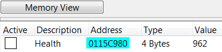

2. **Check Checkbox Hex** and put the Address in it
3. The **Address** to the Pointer is in this ex. 1002CBA40

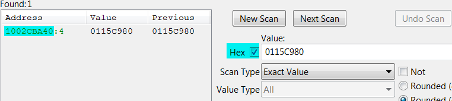

## 🔍 Get the Pointer Address from the Pointer of the Value (Way 2 : harder) (level-1 pointer) 🔍

1. Select **Find out what writes to this address**
2. Press on **More information**

3. The **Address** to the Pointer is in this ex. 011DC7A0

## 🔍 Get the base Address from a multilevel pointer (level-4 pointer) 🔍

### ➡️ Example of a level-4 pointer ➡️

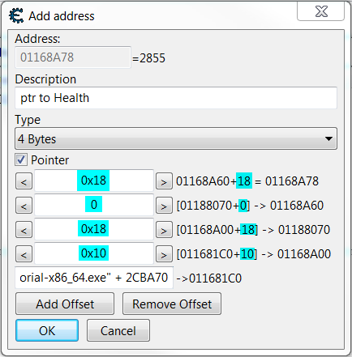

*01168A78* = Address / base pointer (base ptr)

**0x18** = Offset

***"Tutorial-x86_64.exe" + 2CBA70*** = static base address

-> = points to

*01168A78* = Value = 2765

*01188070* -> *1168A60* + **0x18** = *01168A78*

*01168A18* -> *01188070* + **0** = *01188070*

*011681D0* -> *1168A00* + **0x18** = *01168A18*

***"Tutorial-x86_64.exe" + 2CBA70*** -> *11681C0* + **0x10** = *011681D0*

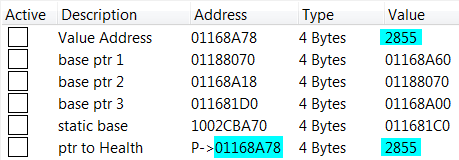

### 🔍 How to find out each base pointer with its offsets until you get to the static base address 🔍

1. Right Click on Address Record
2. Select **Find out what accesses this address**

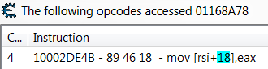

3. calculate the Address with using the Offset ex. -> (***01188070*** -> **1168A60** + 0x18 = 01168A78)
4. **Check Checkbox Hex** and put the Address in it (ex. **1168A60**)
5. The **Address** to the Pointer is in this ex. ***01188070***
6. **Repeat Step 1 to 5** until you get the static base Address, in this ex. ***"Tutorial-x86_64.exe" + 2CBA70***

## ⚙️ Add Pointer Address manually (level-1 pointer) ⚙️

1. Click on **Add Address Manually**

2. Add Address, if needed with Offsets and click **OK**

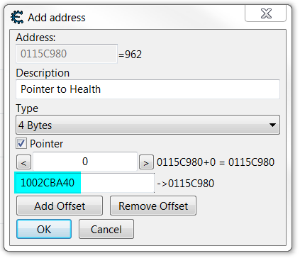

3. The Result should look like this:

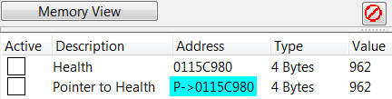

## ⚙️ Add Pointer Address manually (level-4 pointer) ⚙️

1. Click on **Add Address Manually**

2. Add Address, if needed with Offsets and click **OK**

3. The Result should look like this:

## 🛠 Code Injection 🛠

1. Right Click on Address Record
2. Select **Find out what writes to this address**
3. Press **Show disassembler**

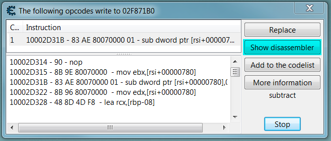

4. Click on **Tools** and select **Auto Assemble**

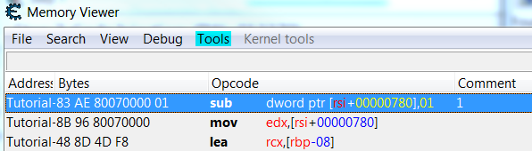

5. Click on **Template** and select **Code Injection**

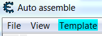

6. Click on **OK**
7. **Comment out** as an ex. //sub dword ptr [rsi+00000780],01 (value - 1)
8. **Write** as an ex. add dword ptr [rsi+00000780],01 (value + 1)

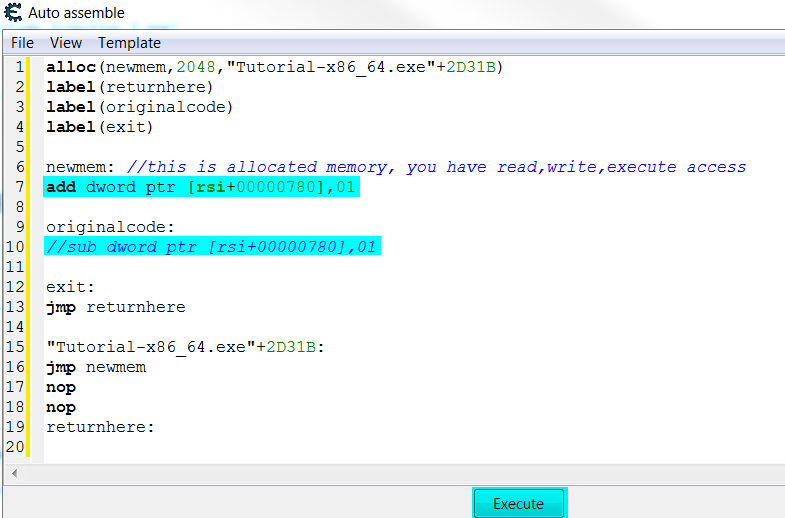

9. Press on **Execute** and then click OK and it's Done!
