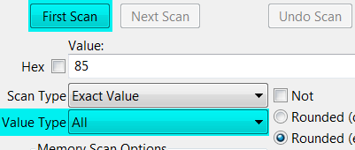
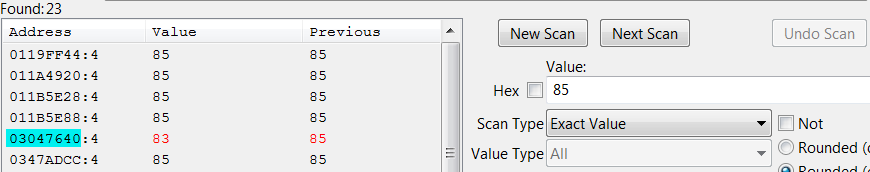
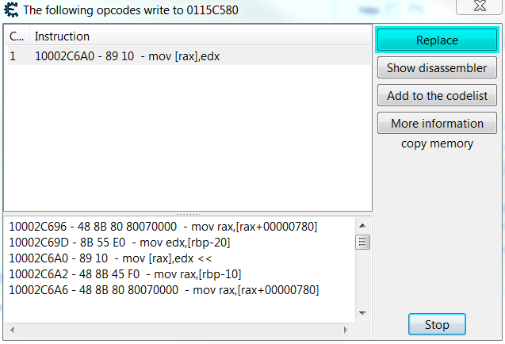
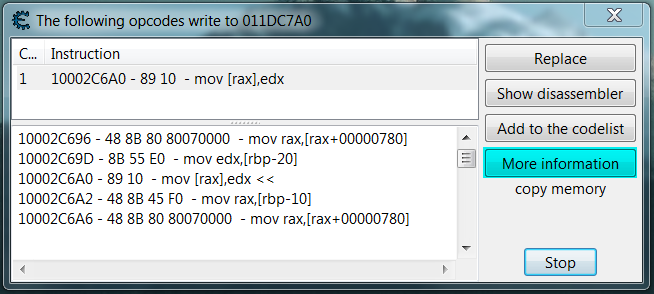
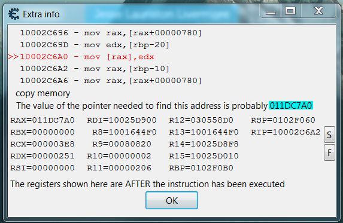

# ⚙️ Simple Disassembly Notes 🔧
⚙️ Simple Step to Step Tutorials for disassembling 🔧

## 🔧 Get Pointer Address from Value 🔧

1. Set Value Type **All**
2. Set Value (ex. (Int 32 = 4 Byte = 32 Bit) 85 or (float/double) 85.5) you search for and press **First Scan**

3. Change Value in the Process
4. The Changed Value will be red, on the left is the **Pointer Address**

## 🔧 Replace the Assembly Code with Code that does Nothing  🔧

1. Right Click on Address Record
2. Select **Find out what writes to this address**
3. Press on **Replace**

4. **Delete the Assembly Code** and Press **OK**

## 🔧 Get the Pointer Address from the Pointer of the Value 🔧

1. Right Click on Address Record
2. Select **Find out what writes to this address**
3. Press on **More information**

4. The **Address** to the Pointer is in this ex. 011DC7A0

## 🔧 Add Pointer Address manually 🔧

1. Click on Add Address Manually

